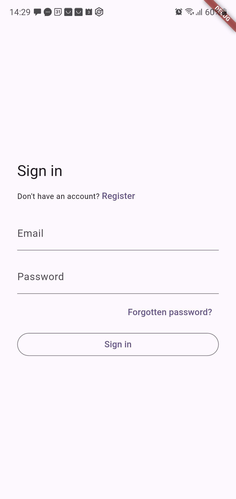
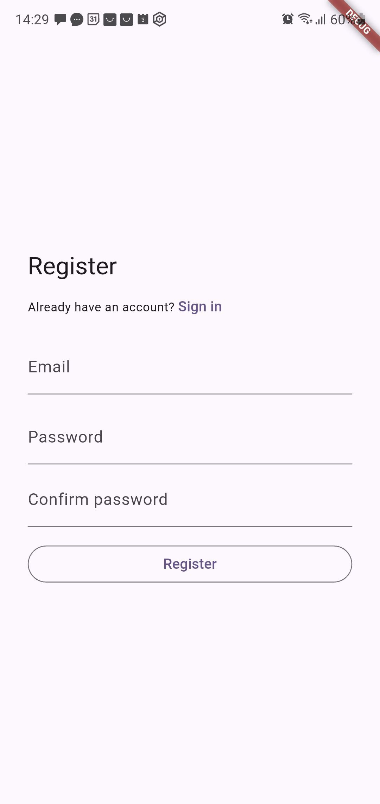
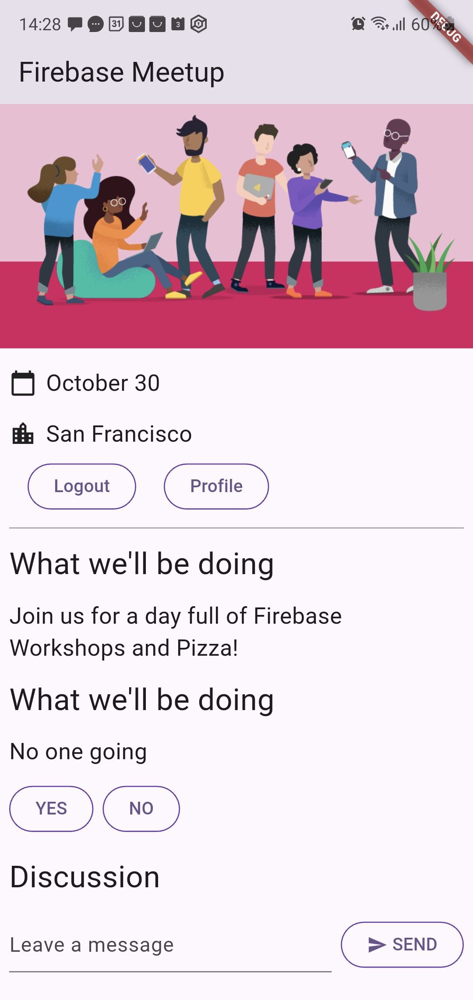
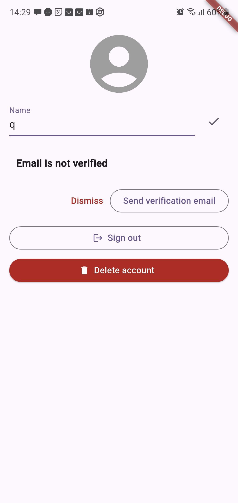

# Firebase Meetup App - Flutter

A Flutter application demonstrating Firebase integration with authentication, Firestore database, and real-time data synchronization. This project showcases how to build a modern mobile app with Firebase backend services.

## 🚀 Features

- **User Authentication**: Email/password authentication with Firebase Auth
- **Real-time Database**: Cloud Firestore for storing and syncing data
- **Event Management**: RSVP functionality for meetup events
- **Guest Book**: Real-time messaging system for event attendees
- **Responsive UI**: Modern Material Design with Google Fonts
- **Cross-platform**: Supports Android, iOS, macOS, and Web

## 📱 Screenshots

> **Note**: To add screenshots to your README, save your app screenshots in the `screenshots/` directory with the following names:
> - `signin.jpg` - Sign in screen
> - `register.jpg` - Registration screen  
> - `home.jpg` - Main meetup page
> - `profile.jpg` - User profile screen

### Authentication Flow
<table>
<tr>
<td align="center">

<br>
<em>Sign in screen with email/password authentication</em>
</td>
<td align="center">

<br>
<em>User registration screen with email verification</em>
</td>
</tr>
</table>

### Main Application
<table>
<tr>
<td align="center">

<br>
<em>Main meetup page showing event details, RSVP options, and guest book</em>
</td>
<td align="center">

<br>
<em>User profile management with email verification status</em>
</td>
</tr>
</table>

### Key Features
- **Event Details**: Clean interface showing meetup information with colorful illustration
- **RSVP System**: Real-time attendee count and yes/no selection buttons
- **Guest Book**: Interactive discussion section for attendees with send functionality
- **User Management**: Profile settings, email verification, and account management
- **Authentication**: Secure sign-in and registration flow with password recovery

## 🛠️ Tech Stack

- **Frontend**: Flutter 3.8.1+
- **Backend**: Firebase
  - Firebase Authentication
  - Cloud Firestore
  - Firebase Core
- **State Management**: Provider
- **Navigation**: GoRouter
- **UI Components**: Material Design with Google Fonts
- **Firebase UI**: Firebase UI Auth for authentication flows

## 📋 Prerequisites

Before you begin, ensure you have the following installed:

- **Flutter SDK** (3.8.1 or higher)
- **Dart SDK** (included with Flutter)
- **Android Studio** (for Android development)
- **Xcode** (for iOS development, macOS only)
- **Firebase CLI** (for Firebase configuration)
- **Git** (for version control)

### Flutter Installation

1. **Download Flutter SDK**:
   - Visit [Flutter.dev](https://flutter.dev/docs/get-started/install)
   - Download the latest stable release for your platform

2. **Extract and Setup**:
   ```bash
   # Extract to your desired location (e.g., C:\flutter on Windows)
   # Add Flutter to your PATH environment variable
   ```

3. **Verify Installation**:
   ```bash
   flutter doctor
   ```

4. **Install Dependencies**:
   ```bash
   flutter pub get
   ```

### Firebase CLI Installation

1. **Install Firebase CLI**:
   ```bash
   # Using npm (Node.js required)
   npm install -g firebase-tools
   
   # Or using standalone binary
   # Download from: https://firebase.google.com/docs/cli#install-cli-windows
   ```

2. **Login to Firebase**:
   ```bash
   firebase login
   ```

## 🔧 Installation & Setup

### 1. Clone the Repository

```bash
git clone <your-repository-url>
cd firebase-get-to-know-flutter
```

### 2. Install Flutter Dependencies

```bash
flutter pub get
```

### 3. Firebase Project Setup

#### Create a Firebase Project

1. Go to [Firebase Console](https://console.firebase.google.com/)
2. Click "Create a project" or "Add project"
3. Enter project name: `firebase-meetup-app` (or your preferred name)
4. Enable Google Analytics (optional)
5. Click "Create project"

#### Configure Firebase for Flutter

1. **Install FlutterFire CLI**:
   ```bash
   dart pub global activate flutterfire_cli
   ```

2. **Configure Firebase for your platforms**:
   ```bash
   flutterfire configure
   ```
   
   This command will:
   - Detect your Flutter project
   - List your Firebase projects
   - Configure Firebase for Android, iOS, Web, and macOS
   - Generate `firebase_options.dart` file

#### Enable Firebase Services

1. **Authentication**:
   - Go to Firebase Console → Authentication → Sign-in method
   - Enable "Email/Password" provider
   - Configure authorized domains if needed

2. **Firestore Database**:
   - Go to Firebase Console → Firestore Database
   - Click "Create database"
   - Choose "Start in test mode" (for development)
   - Select a location for your database

#### Set up Firestore Security Rules

```javascript
rules_version = '2';
service cloud.firestore {
  match /databases/{database}/documents {
    // Allow read/write access to attendees collection
    match /attendees/{userId} {
      allow read, write: if request.auth != null && request.auth.uid == userId;
    }
    
    // Allow read access to all attendees for counting
    match /attendees/{document} {
      allow read: if true;
    }
    
    // Allow read/write access to guestbook for authenticated users
    match /guestbook/{document} {
      allow read, write: if request.auth != null;
    }
  }
}
```

### 4. Platform-Specific Setup

#### Android Setup

1. **Google Services Configuration**:
   - The `google-services.json` file should be automatically added to `android/app/`
   - If not, download it from Firebase Console → Project Settings → Your apps → Android app

2. **Update Android Configuration**:
   - Ensure `android/app/build.gradle` includes:
   ```gradle
   apply plugin: 'com.google.gms.google-services'
   ```

#### iOS Setup

1. **Google Services Configuration**:
   - The `GoogleService-Info.plist` file should be automatically added to `ios/Runner/`
   - If not, download it from Firebase Console → Project Settings → Your apps → iOS app

2. **Update iOS Configuration**:
   - Ensure `ios/Runner/Info.plist` includes necessary permissions

#### Web Setup

1. **Firebase Configuration**:
   - The web configuration is automatically handled by `firebase_options.dart`
   - Ensure your domain is added to authorized domains in Firebase Console

### 5. Update Firebase Configuration

⚠️ **SECURITY WARNING**: Never commit real API keys to version control!

1. **Replace placeholder values** in `lib/firebase_options.dart` with your actual Firebase project configuration
2. **Use environment variables** for production deployments
3. **Keep sensitive data secure** by using `.env` files (already added to `.gitignore`)

The `flutterfire configure` command should have already done this, but verify the configuration matches your Firebase project.

**Important Security Steps:**
- Replace `YOUR_ANDROID_API_KEY_HERE` with your actual Android API key
- Replace `YOUR_PROJECT_ID_HERE` with your Firebase project ID
- Replace other placeholder values with your actual Firebase configuration
- Never commit real API keys to public repositories

## 🚀 Running the Application

### Development Mode

```bash
# Check available devices
flutter devices

# Run on connected device/emulator
flutter run

# Run on specific platform
flutter run -d chrome          # Web
flutter run -d android         # Android
flutter run -d ios             # iOS
flutter run -d macos           # macOS
```

### Build for Production

```bash
# Android APK
flutter build apk --release

# Android App Bundle
flutter build appbundle --release

# iOS
flutter build ios --release

# Web
flutter build web --release

# macOS
flutter build macos --release
```

## 📁 Project Structure

```
lib/
├── main.dart                 # App entry point and routing
├── app_state.dart           # Application state management
├── firebase_options.dart    # Firebase configuration
├── home_page.dart           # Main home screen
├── guest_book.dart          # Guest book functionality
├── guest_book_message.dart  # Guest book message model
├── yes_no_selection.dart    # RSVP selection widget
└── src/
    ├── authentication.dart  # Authentication UI components
    └── widgets.dart         # Reusable UI widgets

assets/
└── codelab.jpg             # App logo/image

android/                    # Android-specific configuration
ios/                       # iOS-specific configuration
macos/                     # macOS-specific configuration
web/                       # Web-specific configuration
```

## 🔑 Key Features Explained

### Authentication Flow
- Users can sign in with email/password
- Email verification is required for new accounts
- Profile management with sign-out functionality
- Protected routes for authenticated users

### Real-time Data
- Attendee count updates in real-time
- Guest book messages sync across all clients
- RSVP status persists per user

### State Management
- Uses Provider pattern for state management
- Centralized application state in `ApplicationState`
- Reactive UI updates based on Firebase data changes

## 🔒 Security Best Practices

### API Key Security
- **Never commit API keys** to version control
- **Use environment variables** for sensitive configuration
- **Rotate API keys** if they are accidentally exposed
- **Use Firebase Security Rules** to protect your data
- **Enable App Check** for additional security

### Environment Variables
Create a `.env` file (already in `.gitignore`) with your actual Firebase configuration:

```bash
# Example .env file structure
ANDROID_API_KEY=your_actual_api_key_here
ANDROID_APP_ID=your_actual_app_id_here
PROJECT_ID=your_actual_project_id_here
```

### Firebase Security Rules
Always implement proper Firestore security rules:

```javascript
rules_version = '2';
service cloud.firestore {
  match /databases/{database}/documents {
    // Restrict access based on authentication
    match /{document=**} {
      allow read, write: if request.auth != null;
    }
  }
}
```

## 🐛 Troubleshooting

### Common Issues

1. **Firebase Configuration Errors**:
   - Ensure `firebase_options.dart` is properly configured
   - Verify Google Services files are in correct locations
   - Check Firebase project settings

2. **Build Errors**:
   ```bash
   flutter clean
   flutter pub get
   flutter run
   ```

3. **Authentication Issues**:
   - Verify Email/Password provider is enabled in Firebase Console
   - Check authorized domains for web platform
   - Ensure proper Firestore security rules

4. **Platform-specific Issues**:
   - **Android**: Check `google-services.json` location
   - **iOS**: Verify `GoogleService-Info.plist` and bundle ID
   - **Web**: Check authorized domains in Firebase Console

### Debug Mode

```bash
# Run with verbose logging
flutter run --verbose

# Check Firebase connection
flutter logs
```

## 📚 Learning Resources

- [Flutter Documentation](https://flutter.dev/docs)
- [Firebase Documentation](https://firebase.google.com/docs)
- [FlutterFire Documentation](https://firebase.flutter.dev/)
- [Provider Package](https://pub.dev/packages/provider)
- [GoRouter Documentation](https://pub.dev/packages/go_router)

## 🤝 Contributing

1. Fork the repository
2. Create a feature branch (`git checkout -b feature/amazing-feature`)
3. Commit your changes (`git commit -m 'Add some amazing feature'`)
4. Push to the branch (`git push origin feature/amazing-feature`)
5. Open a Pull Request

## 📄 License

This project is licensed under the BSD License - see the [LICENSE](LICENSE) file for details.

## 🙏 Acknowledgments

- Flutter team for the amazing framework
- Firebase team for the backend services
- Google Fonts for typography
- The Flutter community for packages and support

---

**Note**: This is a demo application for learning purposes. For production use, ensure proper security rules, error handling, and testing are implemented.
**Note**: This is a demo application for learning purposes. For production use, ensure proper security rules, error handling, and testing are implemented.
